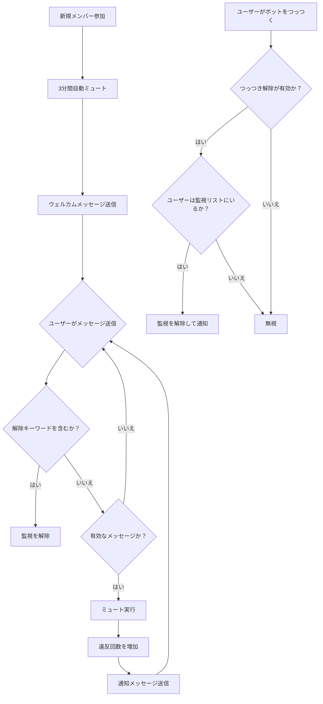

<div align="center">

</div>

# AstrBot 新規メンバー自動ミュートプラグイン v 1.1
別名「参加時ミュート」
[简体中文](https://github.com/nuomicici/astrbot_plugin_auto_ban_new/blob/main/README.md) | [EN](https://github.com/nuomicici/astrbot_plugin_auto_ban_new/blob/main/README_en.md) | 日本語

## 📋 プラグイン情報

- **プラグイン名**: astrbot_plugin_auto_ban_new
- **作者**: 糯米茨 (nuomicici)
- **バージョン**: v1.1
- **リポジトリ**: [GitHub](https://github.com/nuomicici/astrbot_plugin_auto_ban_new)
- **タグ**: グループ管理、ミュート

## 📖 プラグイン紹介

指定されたグループチャットで新しく参加したユーザーを自動的にミュートし、ウェルカムメッセージを送信します。監視を解除する複数の方法をサポートしています。グループ管理者が新規メンバーをより良く管理し、新規メンバーが発言する前にグループルールを読むことを保証するのに役立ちます。

## 📄 更新履歴

### v1.1 (現行バージョン)
- ✨ グループからの退出またはキックを検知する機能を追加し、メンバーがグループを離れた際にそのデータを削除し、ストレージの使用量を削減
- 🔒 違反ユーザーに対する制限措置を追加し、指定された回数ミュートされた場合に自動的にテキストを送信し、グループからキックすることが可能に
- 2025.09.05更新
### v1.0
- ✨ 初期バージョンリリース
- 🔒 新規メンバーの自動ミュートをサポート
- 🎯 段階的なミュートメカニズム
- 🔓 複数の監視解除方法
- ⚙️ 完全な設定システム
- 💾 データの永続的な保存

## ✨ 主な機能

### 🔒 自動ミュートメカニズム
- **新規メンバー参加時**: 自動的にミュートし、ウェルカムメッセージを送信
- **段階的ミュート**: 違反回数に応じてミュート時間を段階的に増加
  - 1回目: 180秒（3分）
  - 2回目: 180秒（3分）
  - 3回目: 600秒（10分）
  - 4回目以降: 3600秒（1時間）
- **メンバー退出時のクリーンアップ**: メンバーがグループを離れたことを識別し、監視リストから自動的に削除して、ストレージファイルが無制限にデータを追加するのを防ぎます
- **自動キック**: 複数回違反したユーザーに対して、回数上限を設定し、その回数に達すると自動的にキックします

### 🎯 スマートメッセージフィルタリング
- 有効なメッセージ（テキスト、@メンション、画像、動画など）を自動的に認識
- 無効なメッセージ（スタンプ、システムメッセージなど）を無視
- 誤ってミュートされるのを防ぐ

### 🔓 複数の監視解除方法

#### 1. キーワードによる解除
- ユーザーがホワイトリストに登録されたキーワードを含むメッセージを送信すると、監視が解除されます
- デフォルトのキーワード：`私はグループルールを読み、遵守することに同意します`
- カスタムキーワードリストをサポート

#### 2. つっつきによる解除
- 監視されているユーザーがボットをつっつくと、監視が解除されます
- この機能は設定ファイルで有効/無効にできます
- 解除後、フレンドリーな通知メッセージが送信されます

### ⚙️ 柔軟な設定システム
- AstrBot管理パネルを介した視覚的な設定をサポート
- すべてのパラメータはカスタマイズ可能
- 設定は再起動なしでリアルタイムに反映されます

## 🚀 インストール方法

- AstrBotのプラグインマーケットで「进群禁言」（参加時ミュート）を検索し、インストールをクリックして完了を待ちます

- または、ソースコードをプラグインフォルダにクローンします：

```bash
# プラグインディレクトリにリポジトリをクローン
cd /AstrBot/data/plugins
git clone https://github.com/nuomicici/astrbot_plugin_auto_ban_new

# コンソールでAstrBotを再起動
```

## ⚙️ 設定ガイド

### 基本設定

| 設定項目 | 型 | 説明 | デフォルト値 |
|---|---|---|---|
| `target_groups` | リスト | 機能を有効にするグループIDのリスト | `[]` (空) |
| `welcome_message` | テキスト | 新規メンバーへのウェルカムメッセージ | デフォルトのウェルカムメッセージ |

### ミュート時間設定

| 設定項目 | 型 | 説明 | デフォルト値 |
|---|---|---|---|
| `first_ban` | 整数 | 1回目のミュート時間（秒） | `180` |
| `second_ban` | 整数 | 2回目のミュート時間（秒） | `180` |
| `third_ban` | 整数 | 3回目のミュート時間（秒） | `600` |
| `fourth_and_more_ban` | 整数 | 4回目以降のミュート時間（秒） | `3600` |

### 通知メッセージ設定

| 設定項目 | 型 | 説明 |
|---|---|---|
| `first_message` | テキスト | 1回目のミュート時の通知 |
| `second_message`| テキスト | 2回目のミュート時の通知 |
| `third_message` | テキスト | 3回目のミュート時の通知 |
| `fourth_and_more_message` | テキスト | 4回目以降のミュート時の通知 |

### 監視解除設定

| 設定項目 | 型 | 説明 | デフォルト値 |
|---|---|---|---|
| `whitelist_keywords` | リスト | 監視を解除するキーワード | `["私はグループルールを読み、遵守することに同意します"]` |
| `enable_poke_whitelist` | ブール値 | つっつきによる監視解除を有効にする | `false` |
| `poke_whitelist_message` | テキスト | つっつきによる解除時の通知メッセージ | デフォルトの通知メッセージ |

### キック関連設定

| 設定項目 | 型 | 説明 | デフォルト値 |
|---|---|---|---|
| `kick_threshold` | 整数 | キックするミュート回数のしきい値（参加時の初回ミュートを含む） | `7` |
| `kick_message` | テキスト | グループからキックされたときの通知メッセージ | デフォルトの通知メッセージ |

## 📝 使用方法

### 管理者操作
1. AstrBot管理パネルで対象のグループIDを設定します
2. 必要に応じてミュート時間と通知メッセージを調整します
3. 監視を解除するためのキーワードをカスタマイズします
4. つっつきによる監視解除機能を有効または無効にします

### ユーザー操作
新規メンバーがグループに参加した後：
1. **通常の手順**: グループルールを読む → 解除キーワードを送信 → 通常通り発言
2. **迅速な解除**: ボットをつっつく → 即座に監視を解除
3. **違反処理**: 監視を解除せずに発言 → 自動的にミュートされ、通知が表示されます

## 🔧 ワークフロー



## 📊 データストレージ

プラグインはユーザーの監視状態を `data/auto_ban_plugin/banned_users.json` に保存します：
- 永続的なストレージで、再起動後もデータは失われません
- 自動バックアップと復元メカニズム
- フォーマット: `[[グループID, ユーザーID], 違反回数]`

## ⚠️ 注意事項

1. **権限要件**: ボットがミュート操作を実行するには、グループの管理者権限が必要です
2. **グループID設定**: 設定で対象のグループIDが正しく入力されていることを確認してください
3. **メッセージフィルタリング**: プラグインは誤作動を防ぐためにシステムメッセージを自動的にフィルタリングします
4. **高優先度**: プラグインは機能が正常に動作することを保証するために高い優先度を使用します

## 🐛 トラブルシューティング

### よくある問題

**Q: プラグインが動作しません。どうすればいいですか？**
A: 次の項目を確認してください：
- ボットに管理者権限がありますか？
- 対象のグループIDが正しく設定されていますか？
- プラグインが正しくインストールされ、有効になっていますか？

**Q: ミュートに失敗します。何が問題ですか？**
A: 通常は権限の問題です：
- ボットがグループの管理者であることを確認してください。
- ミュートされるユーザーがグループのオーナーや他の管理者でないことを確認してください。

**Q: 設定を変更しても反映されません。**
A: 設定の変更はすぐに反映されるはずです。それでも問題が解決しない場合：
- 設定のフォーマットが正しいか確認してください。
- AstrBotサービスを再起動してください。

## 🤝 貢献

IssueやPull Requestをお待ちしております！

## 📄 ライセンス

このプロジェクトはMITライセンスの下でライセンスされています - 詳細は[LICENSE](LICENSE)ファイルをご覧ください。

---

**作者**: 糯米茨 (nuomicici)
**連絡先**:
- [GitHub Issues](https://github.com/nuomicici/astrbot_plugin_auto_ban_new/issues)
- [QQ](https://qm.qq.com/q/wMGXYfKKoS)
