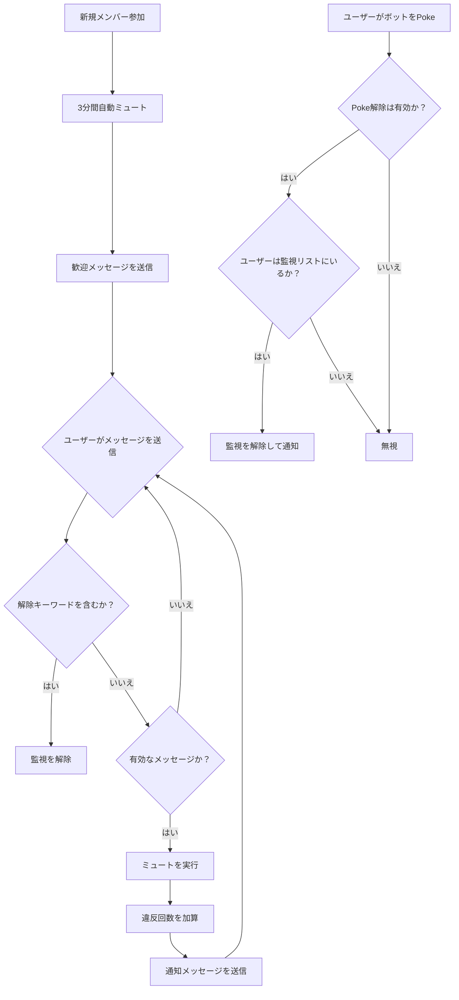

<div align="center">

</div>

# AstrBot 新規メンバー自動ミュートプラグイン
別名「参加時ミュート」  
[简体中文](https://github.com/nuomicici/astrbot_plugin_auto_ban_new/blob/main/README.md) | [EN](https://github.com/nuomicici/astrbot_plugin_auto_ban_new/blob/main/README_en.md) | 日本語

## 📋 プラグイン情報

- **プラグイン名**: astrbot_plugin_auto_ban_new
- **作者**: 糯米茨 (nuomicici)
- **バージョン**: v1.0
- **リポジトリ**: [GitHub](https://github.com/nuomicici/astrbot_plugin_auto_ban_new)
- **タグ**: グループ管理、ミュート

## 📖 プラグイン概要

指定されたグループチャットで、新規参加ユーザーを自動的にミュートし、歓迎メッセージを送信します。監視解除の方法も複数対応。グループ管理者が新規メンバーをより効果的に管理し、発言前にグループルールを読んでもらうことを目的としています。

## ✨ 主な機能

### 🔒 自動ミュート機能
- **新規メンバー参加時**: 自動的にミュートし、歓迎メッセージを送信します。
- **段階的ミュート**: 違反回数に応じてミュート時間を段階的に増加させます。
  - 1回目: 180秒（3分）
  - 2回目: 180秒（3分）
  - 3回目: 600秒（10分）
  - 4回目以降: 3600秒（1時間）

### 🎯 スマートメッセージフィルタリング
- 有効なメッセージ（テキスト、@メンション、画像、動画など）を自動的に識別します。
- 無効なアクション（Poke、システムメッセージなど）は無視します。
- 誤ってミュートが発動するのを防ぎます。

### 🔓 多様な監視解除方法

#### 1. キーワードによる解除
- ユーザーがホワイトリストに登録されたキーワードを含むメッセージを送信すると、監視が解除されます。
- デフォルトのキーワード：`私はグループルールを読み、遵守することに同意します`
- キーワードリストはカスタマイズ可能です。

#### 2. Pokeによる解除
- 監視対象のユーザーがボットをPoke（つっつく）すると、監視が解除されます。
- この機能は設定ファイルで有効/無効を切り替えられます。
- 解除後、フレンドリーな通知メッセージが送信されます。

### ⚙️ 柔軟な設定システム
- AstrBotの管理パネルから視覚的に設定できます。
- すべてのパラメータはカスタマイズ可能です。
- 設定はリアルタイムで反映され、再起動は不要です。

## 🚀 インストール方法

- AstrBotのプラグインマーケットで「进群禁言」を検索し、インストールをクリックして完了を待ちます。

- または、ソースコードをプラグインフォルダにクローンします：

```bash
# プラグインディレクトリにリポジトリをクローン
cd /AstrBot/data/plugins
git clone https://github.com/nuomicici/astrbot_plugin_auto_ban_new

# コンソールでAstrBotを再起動
```

## ⚙️ 設定ガイド

### 基本設定

| 設定項目 | 型 | 説明 | デフォルト値 |
|---|---|---|---|
| `target_groups` | リスト | この機能を有効にするグループIDのリスト | `[]` (空) |
| `welcome_message` | テキスト | 新規メンバーへの歓迎メッセージ | デフォルトの歓迎メッセージ |

### ミュート時間設定

| 設定項目 | 型 | 説明 | デフォルト値 |
|---|---|---|---|
| `first_ban` | 整数 | 1回目のミュート時間（秒） | `180` |
| `second_ban` | 整数 | 2回目のミュート時間（秒） | `180` |
| `third_ban` | 整数 | 3回目のミュート時間（秒） | `600` |
| `fourth_and_more_ban` | 整数 | 4回目以降のミュート時間（秒） | `3600` |

### 通知メッセージ設定

| 設定項目 | 型 | 説明 |
|---|---|---|
| `first_message` | テキスト | 1回目のミュート時の通知 |
| `second_message` | テキスト | 2回目のミュート時の通知 |
| `third_message` | テキスト | 3回目のミュート時の通知 |
| `fourth_and_more_message` | テキスト | 4回目以降のミュート時の通知 |

### 監視解除設定

| 設定項目 | 型 | 説明 | デフォルト値 |
|---|---|---|---|
| `whitelist_keywords` | リスト | 監視を解除するためのキーワード | `["私はグループルールを読み、遵守することに同意します"]` |
| `enable_poke_whitelist` | ブール値 | Pokeによる監視解除を有効にする | `false` |
| `poke_whitelist_message` | テキスト | Pokeで監視が解除された際の通知 | デフォルトの通知メッセージ |

## 📝 使用方法

### 管理者向け操作
1. AstrBotの管理パネルで対象のグループIDを設定します。
2. 必要に応じてミュート時間と通知メッセージを調整します。
3. 監視解除用のキーワードをカスタマイズします。
4. Pokeによる監視解除機能を有効または無効にします。

### ユーザー向け操作
新規メンバー参加後：
1. **通常の手順**: グループルールを読む → 解除キーワードを送信 → 通常通り発言。
2. **クイック解除**: ボットをPokeする → 監視が即座に解除される。
3. **違反時の処理**: 監視を解除せずに発言 → 自動的にミュートされ、通知が送られる。

## 🔧 ワークフロー



## 📊 データストレージ

プラグインはユーザーの監視状態を `data/auto_ban_plugin/banned_users.json` に保存します：
- 永続的なストレージで、再起動してもデータは失われません。
- 自動バックアップおよびリカバリ機能付き。
- フォーマット：`[[グループID, ユーザーID], 違反回数]`

## ⚠️ 注意事項

1. **権限要件**: ボットがミュート操作を行うには、グループの管理者権限が必要です。
2. **グループID設定**: 設定で対象のグループIDを正しく入力してください。
3. **メッセージフィルタリング**: プラグインは誤作動を防ぐため、システムメッセージを自動的にフィルタリングします。
4. **高優先度**: プラグインは機能が正常に動作するよう、高い優先度で処理を実行します。

## 🐛 トラブルシューティング

### よくある質問

**Q: プラグインが動作しない場合はどうすればいいですか？**
A: 以下の項目を確認してください：
- ボットに管理者権限がありますか？
- 対象のグループIDは正しく設定されていますか？
- プラグインは正しくインストールされ、有効になっていますか？

**Q: ミュートに失敗するのはなぜですか？**
A: 通常は権限の問題です：
- ボットがグループの管理者であることを確認してください。
- ミュート対象のユーザーがグループのオーナーや他の管理者ではないことを確認してください。

**Q: 設定を変更しても反映されません。**
A: 設定の変更は即座に反映されるはずです。問題が解決しない場合：
- 設定のフォーマットが正しいか確認してください。
- AstrBotサービスを再起動してください。

## 📄 更新履歴

### v1.0 (現行バージョン)
- ✨ 初期バージョンリリース
- 🔒 新規メンバーの自動ミュートに対応
- 🎯 段階的ミュート機能
- 🔓 多様な監視解除方法
- ⚙️ 包括的な設定システム
- 💾 データ永続化ストレージ

## 🤝 貢献

IssueやPull Requestを歓迎します！

## 📄 ライセンス

このプロジェクトはMITライセンスの下で公開されています。詳細は[LICENSE](LICENSE)ファイルをご覧ください。

---

**作者**: 糯米茨 (nuomicici)
**連絡先**: 
- [GitHub Issues](https://github.com/nuomicici/astrbot_plugin_auto_ban_new/issues)  
- [QQ](https://qm.qq.com/q/wMGXYfKKoS)
