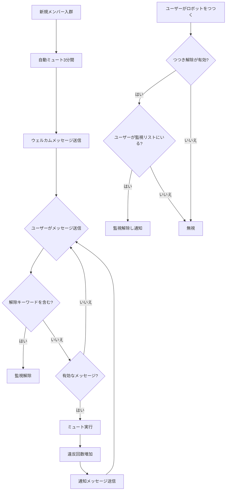

<div align="center">

</div>

# AstrBot 新規メンバー自動ミュートプラグイン v 1.3
別名「入群禁言」  
[简体中文](https://github.com/nuomicici/astrbot_plugin_auto_ban_new/blob/main/README.md) | [EN](https://github.com/nuomicici/astrbot_plugin_auto_ban_new/blob/main/README_en.md) | 日本語

## 📋 プラグイン情報

- **プラグイン名**: astrbot_plugin_auto_ban_new
- **作者**: 糯米茨
- **バージョン**: v1.3
- **リポジトリ**: [GitHub](https://github.com/nuomicici/astrbot_plugin_auto_ban_new)
- **タグ**: グループ管理、ミュート

## 📖 プラグイン概要

指定されたグループチャットで新規参加ユーザーを自動的にミュートし、ウェルカムメッセージを送信します。様々な方法で監視を解除できます。グループ管理者が新規メンバーをより良く管理し、新規メンバーがまずグループルールを読んでから発言できるようにします。

## 📄 更新履歴
### v1.3（現在のバージョン）
- ☠️ ハハハ！コマンド機能を追加しました！
- ✏️ コマンドによる設定調整をサポート、毎回プラグインページで修正する必要がなくなりました（グループ管理者は全て修正可能、bot管理者はこの制限を受けません）
- 🎵 コマンド ` /進群禁言帮助` でコマンドリストを取得
- ✅ botがグループ管理者でない場合、機能が使用できない旨を通知します
- 2025.09.17更新

### v1.2
- 🔐 入群監視機能のオン/オフを追加
    - 設定画面で後続の監視ミュートを無効にできます
    - 監視リストに既に登録されているメンバーは無効化後もミュートされませんが、監視を再有効化すると再度ミュートされます
    - 無効化後に入群したメンバーは監視リストに追加されません
- 2025.09.17更新
### v1.1 
- ✨ 退群・キック判定を追加、グループメンバーがグループを退出した際にそのデータを削除し、容量使用量を削減
- 🔒 規則違反ユーザーに対する制限措置を追加、指定回数ミュートされた場合に自動でテキストを送信しグループから追放
- 2025.09.05更新
### v1.0 
- ✨ 初期版リリース
- 🔒 新規メンバーの自動ミュートをサポート
- 🎯 段階的ミュートメカニズム
- 🔓 複数の監視解除方法
- ⚙️ 完全な設定システム
- 💾 データの永続化ストレージ

## ✨ 主な機能

### 🔒 自動ミュートメカニズム
- **新規メンバー入群**: 自動ミュートしウェルカムメッセージを送信
- **段階的ミュート**: 違反回数に応じてミュート時間を段階的に延長
  - 1回目: 180秒（3分）
  - 2回目: 180秒（3分）
  - 3回目: 600秒（10分）
  - 4回目以降: 3600秒（1時間）
- **メンバー退群でのクリア**: グループメンバーの離脱を認識し、監視リストを自動削除し、ストレージファイルの無制限なデータ追加を防止
- **自動追放**: 複数回違反したユーザーに対して上限回数を設定し、回数に達すると自動で追放

### 🎯 インテリジェントメッセージフィルタリング
- 有効なメッセージを自動認識（テキスト、@、画像、動画など）
- 無効なメッセージを無視（つつく、システムメッセージなど）
- 誤ったミュート発動を回避

### 🔓 複数の監視解除方法

#### 1. キーワード解除
- ホワイトリストキーワードを含むメッセージを送信することで監視解除
- デフォルトキーワード：`我已阅读并同意遵守群规`
- カスタムキーワードリストをサポート

#### 2. つつき解除
- 監視対象ユーザーがロボットをつつくことで監視解除
- 設定ファイルでこの機能をオン/オフ可能
- 解除後にフレンドリーな通知メッセージを送信

### ⚙️ 柔軟な設定システム
- AstrBot管理パネルでの視覚的設定をサポート
- 全てのパラメータをカスタマイズ可能
- 設定はリアルタイムで有効、再起動不要

## 🚀 インストール方法

- astrbotのプラグインマーケットで「进群禁言」を直接検索し、インストールをクリック、完了まで待機

- ソースコードをプラグインフォルダにクローンすることも可能：

```bash
# プラグインディレクトリにリポジトリをクローン
cd /AstrBot/data/plugins
git clone https://github.com/nuomicici/astrbot_plugin_auto_ban_new

# コンソールでAstrBotを再起動
```

## ⚙️ 設定説明

### 基本設定

| 設定項目 | 型 | 説明 | デフォルト値 |
|--------|------|------|--------|
| `target_groups` | リスト | 機能を有効にするグループ番号リスト | `[空]` |
| `welcome_message` | テキスト | 新規メンバー入群ウェルカムメッセージ | デフォルトウェルカム文 |

### ミュート時間設定

| 設定項目 | 型 | 説明 | デフォルト値 |
|--------|------|------|--------|
| `first_ban` | 整数 | 1回目のミュート時間（秒） | `180` |
| `second_ban` | 整数 | 2回目のミュート時間（秒） | `180` |
| `third_ban` | 整数 | 3回目のミュート時間（秒） | `600` |
| `fourth_and_more_ban` | 整数 | 4回目以降のミュート時間（秒） | `3600` |

### 通知メッセージ設定

| 設定項目 | 型 | 説明 |
|--------|------|------|
| `first_message` | テキスト | 1回目のミュート通知 |
| `second_message` | テキスト | 2回目のミュート通知 |
| `third_message` | テキスト | 3回目のミュート通知 |
| `fourth_and_more_message` | テキスト | 4回目以降のミュート通知 |

### 監視解除設定

| 設定項目 | 型 | 説明 | デフォルト値 |
|--------|------|------|--------|
| `whitelist_keywords` | リスト | 監視解除キーワード | `["我已阅读并同意遵守群规"]` |
| `enable_poke_whitelist` | ブール | つつき監視解除を有効化 | `false` |
| `poke_whitelist_message` | テキスト | つつき監視解除通知 | デフォルト通知文 |

### 追放関連設定

| 設定項目 | 型 | 説明 | デフォルト値 |
|--------|------|------|--------|
| `kick_threshold` | 整数 | ミュート回数追放閾値（入群ミュートを含む） | `7` |
| `kick_message` | テキスト | グループ追放時の通知文 | デフォルト通知文 |

## 📝 使用説明

### 管理者操作
1. AstrBot管理パネルで対象グループ番号を設定
2. 必要に応じてミュート時間と通知メッセージを調整
3. 監視解除キーワードをカスタマイズ
4. つつき監視解除機能を有効化または無効化

### ユーザー操作
新規メンバーが入群後：
1. **正常な流れ**: グループルールを読む → 解除キーワードを送信 → 正常に発言
2. **クイック解除**: ロボットをつつく → 即座に監視解除
3. **違反処理**: 監視解除せずに直接発言 → 自動ミュートし通知

## 🔧 ワークフロー



## 📊 データストレージ

プラグインは `data/auto_ban_plugin/banned_users.json` でユーザー監視状態を保存：
- 永続化ストレージ、再起動後もデータは失われません
- 自動バックアップと復旧メカニズム
- フォーマット：`[[グループID, ユーザーID], 違反回数]`

## ⚠️ 注意事項

1. **権限要件**: ロボットがミュート操作を実行するにはグループ管理者権限が必要
2. **グループ番号設定**: 設定で対象グループ番号を正しく記入してください
3. **メッセージフィルタリング**: プラグインは自動でシステムメッセージをフィルタリングし、誤発動を回避
4. **高優先度**: プラグインは高優先度処理を使用し、機能の正常動作を保証

## 🐛 トラブルシューティング

### よくある問題

**Q: プラグインが動作しない場合は？**
A: 以下の項目を確認してください：
- ロボットが管理者権限を持っているか
- 対象グループ番号が正しく設定されているか
- プラグインが正しくインストールされ有効化されているか

**Q: ミュートが失敗する場合は？**
A: 通常は権限問題です：
- ロボットがグループ管理者であることを確認
- ミュート対象ユーザーがグループ主や他の管理者でないことを確認

**Q: 設定変更後に有効にならない場合は？**
A: 設定変更後は即座に有効になりますが、まだ問題がある場合：
- 設定フォーマットが正しいか確認
- AstrBotサービスを再起動

## 🤝 貢献

IssueやPull Requestの提出を歓迎します！

## 📄 ライセンス

本プロジェクトはMITライセンスを採用 - 詳細は [LICENSE](LICENSE) ファイルをご確認ください。

---

**作者**: 糯米茨  
**連絡先**: 
- [GitHub Issues](https://github.com/nuomicici/astrbot_plugin_auto_ban_new/issues)  
- [QQ](https://qm.qq.com/q/wMGXYfKKoS)
