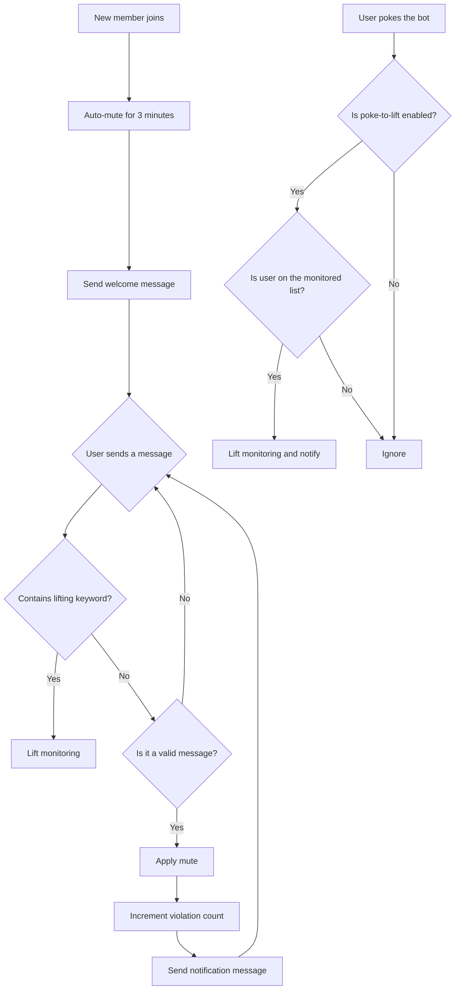

<div align="center">

</div>

# AstrBot Auto Mute New Member Plugin
Also known as "Mute on Join"  
[简体中文](https://github.com/nuomicici/astrbot_plugin_auto_ban_new/blob/main/README.md)|EN|[日本語](https://github.com/nuomicici/astrbot_plugin_auto_ban_new/blob/main/README_JP.md)

## 📋 Plugin Information

- **Plugin Name**: astrbot_plugin_auto_ban_new
- **Author**: 糯米茨 (nuomicici)
- **Version**: v1.0
- **Repository**: [GitHub](https://github.com/nuomicici/astrbot_plugin_auto_ban_new)
- **Tags**: Group Management, Mute

## 📖 Plugin Introduction

This plugin automatically mutes new users in specified group chats and sends a welcome message. It supports multiple ways to lift the monitoring. It helps group administrators better manage new members and ensures that they read the group rules before speaking.

## ✨ Key Features

### 🔒 Automatic Mute Mechanism
- **New Member Joins**: Automatically mutes the user and sends a welcome message.
- **Progressive Muting**: Gradually increases the mute duration based on the number of violations.
  - 1st time: 180 seconds (3 minutes)
  - 2nd time: 180 seconds (3 minutes)
  - 3rd time: 600 seconds (10 minutes)
  - 4th time and beyond: 3600 seconds (1 hour)

### 🎯 Smart Message Filtering
- Automatically identifies valid messages (text, @mentions, images, videos, etc.).
- Ignores invalid actions (pokes, system messages, etc.).
- Prevents accidental muting triggers.

### 🔓 Multiple Ways to Lift Monitoring

#### 1. Keyword-based Lift
- Users can lift the monitoring by sending a message containing a whitelisted keyword.
- Default keyword: `I have read and agree to abide by the group rules`
- Supports a custom list of keywords.

#### 2. Poke to Lift
- Monitored users can poke the bot to lift the monitoring.
- This feature can be enabled/disabled in the configuration file.
- A friendly notification message will be sent after it's lifted.

### ⚙️ Flexible Configuration System
- Supports visual configuration through the AstrBot management panel.
- All parameters are customizable.
- Configurations take effect in real-time without needing a restart.

## 🚀 Installation

- Search for "进群禁言" in the AstrBot plugin market, click install, and wait for it to complete.

- Alternatively, clone the source code into the plugins folder:

```bash
# Clone the repository to the plugins directory
cd /AstrBot/data/plugins
git clone https://github.com/nuomicici/astrbot_plugin_auto_ban_new

# Restart AstrBot from the console
```

## ⚙️ Configuration Guide

### Basic Configuration

| Option | Type | Description | Default |
|--------|------|-------------|---------|
| `target_groups` | List | A list of group IDs where the feature is enabled. | `[]` (Empty) |
| `welcome_message` | String | The welcome message for new members. | Default welcome message |

### Mute Duration Configuration

| Option | Type | Description | Default |
|--------|------|-------------|---------|
| `first_ban` | Integer | Mute duration for the 1st time (seconds). | `180` |
| `second_ban` | Integer | Mute duration for the 2nd time (seconds). | `180` |
| `third_ban` | Integer | Mute duration for the 3rd time (seconds). | `600` |
| `fourth_and_more_ban` | Integer | Mute duration for the 4th time and beyond (seconds). | `3600` |

### Notification Message Configuration

| Option | Type | Description |
|--------|------|-------------|
| `first_message` | String | Notification for the 1st mute. |
| `second_message` | String | Notification for the 2nd mute. |
| `third_message` | String | Notification for the 3rd mute. |
| `fourth_and_more_message` | String | Notification for the 4th mute and beyond. |

### Monitoring Lift Configuration

| Option | Type | Description | Default |
|--------|------|-------------|---------|
| `whitelist_keywords` | List | Keywords to lift monitoring. | `["I have read and agree to abide by the group rules"]` |
| `enable_poke_whitelist` | Boolean | Enable lifting monitoring by poking the bot. | `false` |
| `poke_whitelist_message` | String | Notification when monitoring is lifted via a poke. | Default notification |

## 📝 Usage Instructions

### For Administrators
1. Configure the target group IDs in the AstrBot management panel.
2. Adjust mute durations and notification messages as needed.
3. Customize the keywords for lifting the monitoring.
4. Enable or disable the poke-to-lift feature.

### For Users
After a new member joins:
1. **Normal Flow**: Read group rules → Send the keyword to lift the mute → Speak normally.
2. **Quick Lift**: Poke the bot → Monitoring is lifted immediately.
3. **Violation Handling**: Speaking without lifting the monitoring → Automatically muted with a notification.

## 🔧 Workflow



## 📊 Data Storage

The plugin stores the monitoring status of users in `data/auto_ban_plugin/banned_users.json`:
- Persistent storage, data is not lost on restart.
- Automatic backup and recovery mechanism.
- Format: `[[GroupID, UserID], ViolationCount]`

## ⚠️ Important Notes

1. **Permission Requirements**: The bot needs administrator permissions in the group to perform mute operations.
2. **Group ID Configuration**: Ensure the target group IDs are correctly entered in the configuration.
3. **Message Filtering**: The plugin automatically filters system messages to avoid false triggers.
4. **High Priority**: The plugin operates with a high priority to ensure its functionality runs correctly.

## 🐛 Troubleshooting

### Frequently Asked Questions

**Q: What should I do if the plugin isn't working?**
A: Check the following:
- Does the bot have administrator permissions?
- Is the target group ID configured correctly?
- Is the plugin installed and enabled properly?

**Q: What if the mute action fails?**
A: This is usually a permission issue:
- Ensure the bot is a group administrator.
- Check that the user being muted is not the group owner or another administrator.

**Q: My configuration changes are not taking effect?**
A: Configuration changes should apply immediately. If you still have issues:
- Check if the configuration format is correct.
- Restart the AstrBot service.

## 📄 Changelog

### v1.0 (Current Version)
- ✨ Initial release
- 🔒 Support for auto-muting new members
- 🎯 Progressive mute mechanism
- 🔓 Multiple ways to lift monitoring
- ⚙️ Comprehensive configuration system
- 💾 Persistent data storage

## 🤝 Contributing

Issues and Pull Requests are welcome!

## 📄 License

This project is licensed under the MIT License - see the [LICENSE](LICENSE) file for details.

---

**Author**: 糯米茨 (nuomicici)
**Contact**: 
- [GitHub Issues](https://github.com/nuomicici/astrbot_plugin_auto_ban_new/issues)  
- [QQ](https://qm.qq.com/q/wMGXYfKKoS)
