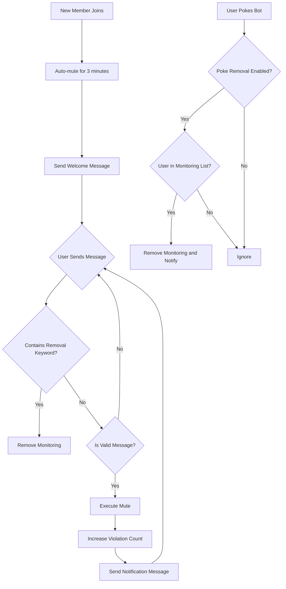

<div align="center">

</div>

# AstrBot Auto-Mute New Members Plugin v 1.3
Also known as "Auto-Mute on Join"  
[简体中文](https://github.com/nuomicici/astrbot_plugin_auto_ban_new/blob/main/README.md) | EN | [日本語](https://github.com/nuomicici/astrbot_plugin_auto_ban_new/blob/main/README_JP.md)

## 📋 Plugin Information

- **Plugin Name**: astrbot_plugin_auto_ban_new
- **Author**: 糯米茨
- **Version**: v1.3
- **Repository**: [GitHub](https://github.com/nuomicici/astrbot_plugin_auto_ban_new)
- **Tags**: Group Management, Muting

## 📖 Plugin Overview

Automatically mute new members in specified group chats and send welcome messages, with support for various methods to remove monitoring. Helps group administrators better manage new members, ensuring new members read group rules before speaking.

## 📄 Changelog
### v1.3 (Current Version)
- ☠️ Haha! Added command functionality!
- ✏️ Now supports configuration adjustment through commands, no need to go to the plugin page for every modification (all group administrators can modify, bot owner is not subject to this restriction)
- 🎵 Use command ` /进群禁言帮助` to get command list
- ✅ For cases where the bot is not a group administrator, it will prompt that the feature cannot be used
- Updated on 2025.09.17
### v1.2
- 🔐 Added toggle for join monitoring functionality
    - Can disable subsequent monitoring and muting in the configuration interface
    - Members already in the monitoring list won't be muted after disabling, but will still be muted when monitoring is re-enabled
    - Members who join after disabling won't be added to the monitoring list
- Updated on 2025.09.17
### v1.1 
- ✨ Added detection for member leaving or being kicked, automatically deleting their data when group members leave to reduce storage usage
- 🔒 Added restrictions for rule-violating users, can automatically send text and kick from group when muted a specified number of times
- Updated on 2025.09.05
### v1.0 
- ✨ Initial version release
- 🔒 Support for auto-muting new members
- 🎯 Progressive muting mechanism
- 🔓 Multiple monitoring removal methods
- ⚙️ Complete configuration system
- 💾 Persistent data storage

## ✨ Main Features

### 🔒 Auto-Mute Mechanism
- **New member joins**: Automatically mute and send welcome message
- **Progressive muting**: Gradually increase mute duration based on violation count
  - 1st time: 180 seconds (3 minutes)
  - 2nd time: 180 seconds (3 minutes)
  - 3rd time: 600 seconds (10 minutes)
  - 4th time and beyond: 3600 seconds (1 hour)
- **Clear on member exit**: Recognizes when group members leave the group, automatically deletes monitoring list to prevent unlimited data accumulation in storage files
- **Auto-kick**: Sets upper limit for repeat offenders, automatically kicks when threshold is reached

### 🎯 Intelligent Message Filtering
- Automatically identifies valid messages (text, @mentions, images, videos, etc.)
- Ignores invalid messages (pokes, system messages, etc.)
- Avoids accidental muting triggers

### 🔓 Multiple Monitoring Removal Methods

#### 1. Keyword Removal
- Users can remove monitoring by sending messages containing whitelist keywords
- Default keyword: `我已阅读并同意遵守群规`
- Supports custom keyword lists

#### 2. Poke Removal
- Monitored users can remove monitoring by poking the bot
- Can enable/disable this feature through configuration file
- Sends friendly notification message after removal

### ⚙️ Flexible Configuration System
- Supports visual configuration through AstrBot management panel
- All parameters are customizable
- Configuration takes effect immediately, no restart required

## 🚀 Installation Method

- Search for "进群禁言" directly in AstrBot's plugin marketplace, click install, and wait for completion

- You can also clone the source code to the plugins folder:

```bash
# Clone repository to plugins directory
cd /AstrBot/data/plugins
git clone https://github.com/nuomicici/astrbot_plugin_auto_ban_new

# Restart AstrBot from console
```

## ⚙️ Configuration Guide

### Basic Configuration

| Configuration | Type | Description | Default Value |
|--------------|------|-------------|---------------|
| `target_groups` | List | Group ID list where functionality is enabled | `[Empty]` |
| `welcome_message` | Text | Welcome message for new members | Default welcome text |

### Mute Duration Configuration

| Configuration | Type | Description | Default Value |
|--------------|------|-------------|---------------|
| `first_ban` | Integer | 1st mute duration (seconds) | `180` |
| `second_ban` | Integer | 2nd mute duration (seconds) | `180` |
| `third_ban` | Integer | 3rd mute duration (seconds) | `600` |
| `fourth_and_more_ban` | Integer | 4th and subsequent mute duration (seconds) | `3600` |

### Notification Message Configuration

| Configuration | Type | Description |
|--------------|------|-------------|
| `first_message` | Text | 1st mute notification |
| `second_message` | Text | 2nd mute notification |
| `third_message` | Text | 3rd mute notification |
| `fourth_and_more_message` | Text | 4th and subsequent mute notification |

### Monitoring Removal Configuration

| Configuration | Type | Description | Default Value |
|--------------|------|-------------|---------------|
| `whitelist_keywords` | List | Keywords for monitoring removal | `["我已阅读并同意遵守群规"]` |
| `enable_poke_whitelist` | Boolean | Enable poke-to-remove monitoring | `false` |
| `poke_whitelist_message` | Text | Poke removal notification | Default notification text |

### Kick-related Configuration

| Configuration | Type | Description | Default Value |
|--------------|------|-------------|---------------|
| `kick_threshold` | Integer | Mute count threshold for kicking (including initial join mute) | `7` |
| `kick_message` | Text | Notification message when kicking from group | Default notification text |

## 📝 Usage Instructions

### Administrator Operations
1. Configure target group IDs in the AstrBot management panel
2. Adjust mute durations and notification messages as needed
3. Customize monitoring removal keywords
4. Enable or disable poke-to-remove monitoring functionality

### User Operations
After new members join the group:
1. **Normal flow**: Read group rules → Send removal keyword → Normal conversation
2. **Quick removal**: Poke the bot → Immediately remove monitoring
3. **Violation handling**: Speak directly without removing monitoring → Automatic mute and notification

## 🔧 Workflow



## 📊 Data Storage

The plugin stores user monitoring status in `data/auto_ban_plugin/banned_users.json`:
- Persistent storage, data is not lost after restart
- Automatic backup and recovery mechanism
- Format: `[[Group ID, User ID], Violation Count]`

## ⚠️ Important Notes

1. **Permission Requirements**: Bot needs group administrator permissions to execute muting operations
2. **Group ID Configuration**: Please ensure target group IDs are correctly filled in the configuration
3. **Message Filtering**: Plugin automatically filters system messages to avoid accidental triggers
4. **High Priority**: Plugin uses high priority processing to ensure normal functionality

## 🐛 Troubleshooting

### Common Issues

**Q: Plugin not working?**
A: Check the following:
- Does the bot have administrator permissions?
- Are target group IDs configured correctly?
- Is the plugin properly installed and enabled?

**Q: Muting fails?**
A: Usually a permission issue:
- Ensure the bot is a group administrator
- Check that the muted user is not the group owner or another administrator

**Q: Configuration changes not taking effect?**
A: Configuration changes take effect immediately. If there are still issues:
- Check if configuration format is correct
- Restart AstrBot service

## 🤝 Contributing

Issues and Pull Requests are welcome!

## 📄 License

This project is licensed under the MIT License - see the [LICENSE](LICENSE) file for details.

---

**Author**: 糯米茨  
**Contact**: 
- [GitHub Issues](https://github.com/nuomicici/astrbot_plugin_auto_ban_new/issues)  
- [QQ](https://qm.qq.com/q/wMGXYfKKoS)
