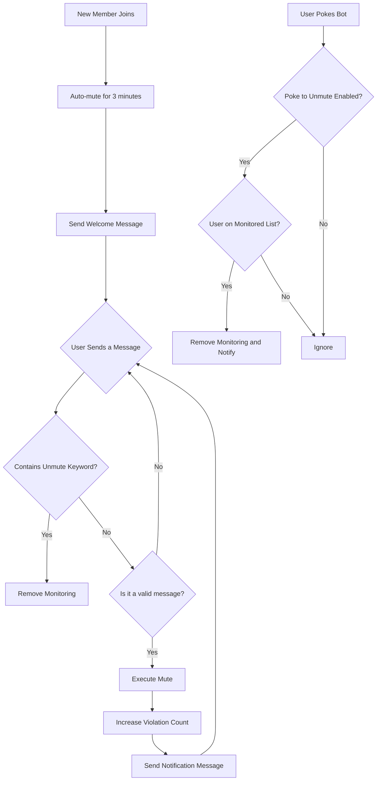

<div align="center">
</div>

# AstrBot Auto Mute New Members Plugin v 1.1
Also known as "Mute on Join"
[简体中文](https://github.com/nuomicici/astrbot_plugin_auto_ban_new/blob/main/README.md) | EN | [日本語](https://github.com/nuomicici/astrbot_plugin_auto_ban_new/blob/main/README_JP.md)

## 📋 Plugin Information

- **Plugin Name**: astrbot_plugin_auto_ban_new
- **Author**: 糯米茨 (nuomicici)
- **Version**: v1.1
- **Repository**: [GitHub](https://github.com/nuomicici/astrbot_plugin_auto_ban_new)
- **Tags**: Group Management, Mute

## 📖 Plugin Introduction

This plugin automatically mutes new members in specified group chats and sends a welcome message. It supports multiple ways to remove the mute. It helps group administrators better manage new members and ensures that new members read the group rules before speaking.

## 📄 Changelog

### v1.1 (Current Version)
- ✨ Added detection for members leaving or being kicked, deleting their data to reduce storage usage
- 🔒 Added restrictive measures for users who violate rules, allowing for automatic text messages and kicking from the group after a specified number of mutes
- Updated on 2025.09.05
### v1.0
- ✨ Initial release
- 🔒 Support for automatically muting new members
- 🎯 Progressive mute mechanism
- 🔓 Multiple ways to remove monitoring
- ⚙️ Complete configuration system
- 💾 Persistent data storage

## ✨ Key Features

### 🔒 Automatic Mute Mechanism
- **New Member Joins**: Automatically mutes and sends a welcome message
- **Progressive Mute**: Gradually increases the mute duration based on the number of violations
  - 1st time: 180 seconds (3 minutes)
  - 2nd time: 180 seconds (3 minutes)
  - 3rd time: 600 seconds (10 minutes)
  - 4th time and beyond: 3600 seconds (1 hour)
- **Member Departure Cleanup**: Identifies when a member leaves the group and automatically removes them from the monitoring list to prevent unlimited data growth in the storage file.
- **Automatic Kick**: For users with multiple violations, a threshold can be set to automatically kick them from the group.

### 🎯 Smart Message Filtering
- Automatically recognizes valid messages (text, @mentions, images, videos, etc.)
- Ignores invalid messages (pokes, system messages, etc.)
- Avoids accidental mutes

### 🔓 Multiple Ways to Remove Monitoring

#### 1. Keyword Removal
- Users can have the monitoring removed by sending a message containing a whitelisted keyword
- Default keyword: `I have read and agree to abide by the group rules`
- Supports custom keyword lists

#### 2. Poke to Unmute
- Monitored users can poke the bot to have the monitoring removed
- This feature can be enabled/disabled via the configuration file
- A friendly notification message is sent upon removal

### ⚙️ Flexible Configuration System
- Supports visual configuration through the AstrBot management panel
- All parameters are customizable
- Configurations take effect in real-time without needing a restart

## 🚀 Installation

- Search for "进群禁言" (Mute on Join) in the AstrBot plugin market, click install, and wait for it to complete.

- Alternatively, clone the source code into the plugins folder:

```bash
# Clone the repository to the plugins directory
cd /AstrBot/data/plugins
git clone https://github.com/nuomicici/astrbot_plugin_auto_ban_new

# Restart AstrBot from the console
```

## ⚙️ Configuration Guide

### Basic Configuration

| Option | Type | Description | Default Value |
|---|---|---|---|
| `target_groups` | List | List of group IDs to enable the feature for | `[]` (empty) |
| `welcome_message` | Text | Welcome message for new members | Default welcome message |

### Mute Duration Configuration

| Option | Type | Description | Default Value |
|---|---|---|---|
| `first_ban` | Integer | 1st mute duration (seconds) | `180` |
| `second_ban` | Integer | 2nd mute duration (seconds) | `180` |
| `third_ban` | Integer | 3rd mute duration (seconds) | `600` |
| `fourth_and_more_ban` | Integer | 4th and subsequent mute duration (seconds) | `3600` |

### Notification Message Configuration

| Option | Type | Description |
|---|---|---|
| `first_message` | Text | Notification for the 1st mute |
| `second_message`| Text | Notification for the 2nd mute |
| `third_message` | Text | Notification for the 3rd mute |
| `fourth_and_more_message` | Text | Notification for the 4th and subsequent mutes |

### Unmonitoring Configuration

| Option | Type | Description | Default Value |
|---|---|---|---|
| `whitelist_keywords` | List | Keywords to remove monitoring | `["I have read and agree to abide by the group rules"]` |
| `enable_poke_whitelist` | Boolean | Enable poke to remove monitoring | `false` |
| `poke_whitelist_message` | Text | Notification message for poke removal | Default notification message |

### Kick Configuration

| Option | Type | Description | Default Value |
|---|---|---|---|
| `kick_threshold` | Integer | Mute count threshold to kick (includes the initial mute on join) | `7` |
| `kick_message` | Text | Notification message when kicked from the group | Default notification message |

## 📝 Usage Instructions

### Admin Operations
1. Configure the target group IDs in the AstrBot management panel
2. Adjust mute durations and notification messages as needed
3. Customize the keywords for removing monitoring
4. Enable or disable the poke to unmute feature

### User Operations
For new members joining the group:
1. **Normal Flow**: Read group rules → Send the unmute keyword → Speak normally
2. **Quick Removal**: Poke the bot → Immediately remove monitoring
3. **Violation Handling**: Speaking without being unmonitored → Automatically muted with a notification

## 🔧 Workflow



## 📊 Data Storage

The plugin stores the user monitoring status in `data/auto_ban_plugin/banned_users.json`:
- Persistent storage, data is not lost on restart
- Automatic backup and recovery mechanism
- Format: `[[GroupID, UserID], ViolationCount]`

## ⚠️ Important Notes

1. **Permission Requirements**: The bot needs group administrator privileges to perform mutes.
2. **Group ID Configuration**: Please ensure the target group IDs are correctly entered in the configuration.
3. **Message Filtering**: The plugin automatically filters system messages to prevent accidental triggers.
4. **High Priority**: The plugin uses a high priority to ensure its functions run correctly.

## 🐛 Troubleshooting

### Common Issues

**Q: The plugin isn't working. What should I do?**
A: Check the following:
- Does the bot have administrator privileges?
- Is the target group ID configured correctly?
- Is the plugin installed and enabled correctly?

**Q: Muting fails. What's wrong?**
A: This is usually a permission issue:
- Ensure the bot is a group administrator.
- Check that the user being muted is not the group owner or another administrator.

**Q: Configuration changes aren't taking effect.**
A: Configuration changes should apply immediately. If you still have issues:
- Check if the configuration format is correct.
- Restart the AstrBot service.

## 🤝 Contributing

Issues and Pull Requests are welcome!

## 📄 License

This project is licensed under the MIT License - see the [LICENSE](LICENSE) file for details.

---

**Author**: 糯米茨 (nuomicici)
**Contact**:
- [GitHub Issues](https://github.com/nuomicici/astrbot_plugin_auto_ban_new/issues)
- [QQ](https://qm.qq.com/q/wMGXYfKKoS)
